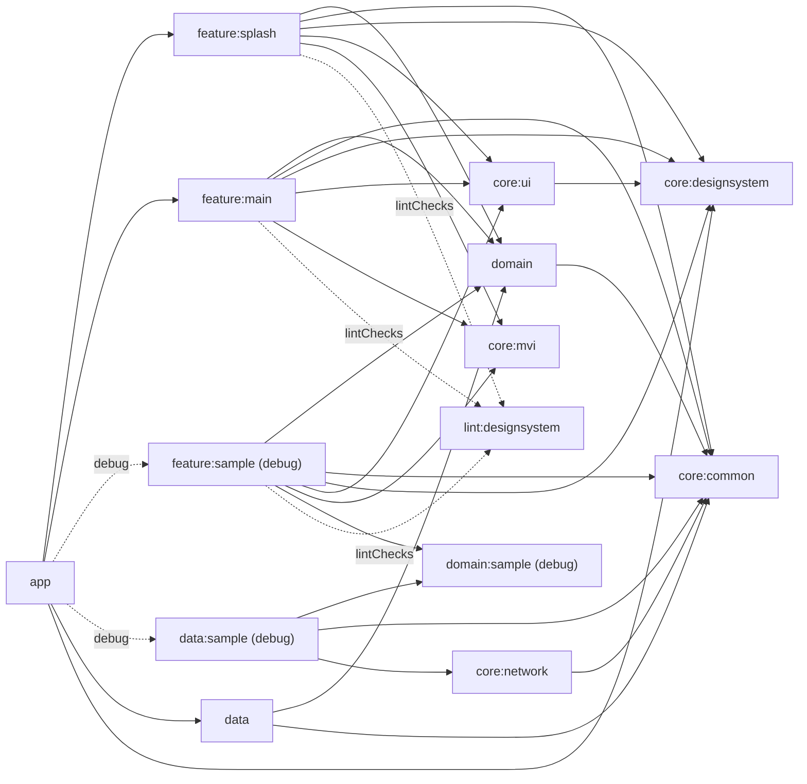

# BleBridge

BLE 통신 기능을 확장하기 위한 Kotlin, Compose, MVI 기반 Android 멀티모듈 프로젝트입니다.

## 모듈 구조

화살표는 `의존하는 모듈 --> 의존 대상`을 의미합니다.



`app`은 최종 APK를 조립하는 composition root입니다. 하위 모듈은 `app`을 참조하지 않으며 개별적으로 컴파일하고 테스트할 수 있습니다.

## 문서

- [문서 인덱스](docs/README.md)
- [에이전트 개발 가이드](docs/agent/README.md)
- [Graphify 운영 가이드](docs/graphify/README.md)
- [App](app/README.md)
- [Domain](domain/README.md)
- [Data](data/README.md)
- [Core 모듈 그룹](core/README.md)
- [Feature 모듈 그룹](feature/README.md)
- [Gradle Convention Plugin](build-logic/README.md)
- [Feature UI 구성 컨벤션](docs/feature/README.md)
- [네비게이션 컨벤션](docs/navigation/README.md)
- [테스트 컨벤션](docs/test/README.md)
- [디자인시스템 상세 가이드](docs/design-system/README.md)
- [Custom lint](lint/README.md)

## 검증

```bash
./gradlew :domain:test :data:testDebugUnitTest :feature:splash:testDebugUnitTest
./gradlew :feature:splash:assembleDebugAndroidTest :feature:main:assembleDebugAndroidTest
./gradlew :data:sample:testDebugUnitTest :feature:sample:testDebugUnitTest
./gradlew :lint:designsystem:test :feature:main:lintDebug :feature:splash:lintDebug
./gradlew :app:assembleDebug :app:lintDebug
```
