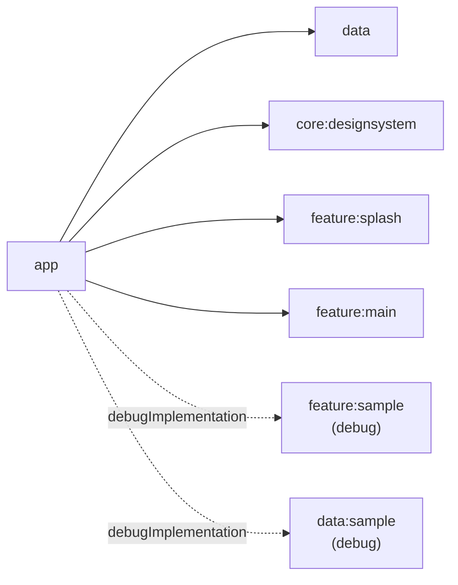

# App 모듈

## 목적

최종 APK를 만들고 Application, Activity, Hilt graph, Compose NavHost를 조립합니다.

## 의존성



- 허용: feature route, data의 DI binding 포함, 최상위 design system 적용
- 금지: repository 구현 직접 호출, 비즈니스 규칙, feature UI 구현
- 다른 모듈이 `app`을 의존해서는 안 됩니다.

## 주요 구성

- `BleBridgeApplication`: Hilt application
- `MainActivity`: 시스템 Splash와 Compose 진입점
- `BleBridgeApp`: `SplashRoute`와 `MainRoute` 조립
- debug variant: `feature:sample`/`data:sample`을 포함하고
  `blebridge-debug://sample` 딥링크를 random Cat Fact 화면에 등록
- Convention Plugin: `blebridge.android.application`

## 릴리스 빌드

`release` 빌드 타입은 `isMinifyEnabled` / `isShrinkResources`가 켜져 있어 R8이 난독화·축소를 수행합니다. `app/proguard-rules.pro`에는 스택트레이스 유지, Kotlin 메타데이터, `domain`/`core:common`(kotlin.jvm 모듈이라 `consumerProguardFiles` 사용 불가) keep, `@HiltViewModel` 보완 keep이 있습니다. Hilt/coroutines/kotlinx.serialization/Navigation Compose는 각자 AAR에 번들된 consumer proguard 규칙으로 커버되므로 별도 규칙을 추가하지 않았습니다.

```bash
./gradlew :app:assembleRelease
```

## 테스트

```bash
./gradlew :app:testDebugUnitTest :app:assembleDebugAndroidTest
./gradlew :app:assembleDebug :app:lintDebug
```
