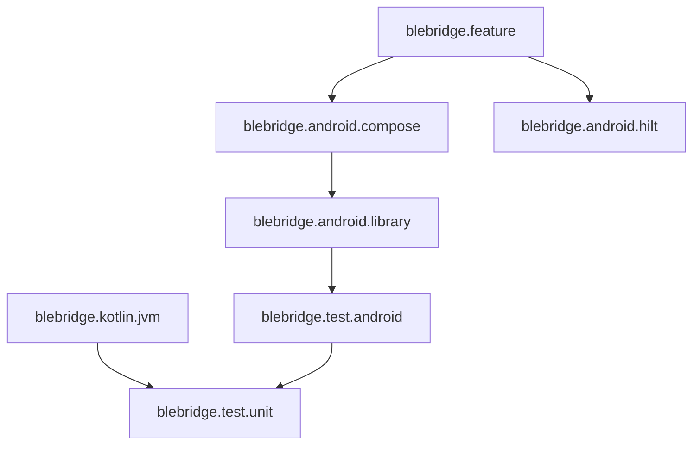

# BleBridge Gradle Convention Plugin

모듈별 Gradle 설정과 테스트 의존성을 일관되게 적용합니다.

공통 Android 설정은 compile SDK 37, min SDK 30, Java 17입니다. Application은 target
SDK 36을 사용합니다.

## Plugin 목록

| Plugin | 포함 내용 |
|---|---|
| `blebridge.test.unit` | JUnit 5, coroutines-test, MockK |
| `blebridge.test.android` | unit plugin, AndroidX JUnit, runner, rules, Espresso |
| `blebridge.kotlin.jvm` | Kotlin JVM, Java 17, unit test |
| `blebridge.android.library` | Android library, SDK 설정, Android test |
| `blebridge.android.compose` | Android library, Compose, Compose UI test |
| `blebridge.android.hilt` | Hilt, KSP |
| `blebridge.feature` | Compose, Hilt, domain/core, Turbine test, `lint:designsystem` |
| `blebridge.android.application` | Android app, Compose, Hilt, test |

## 조합



Compose UI 테스트 의존성은 일반 Android 테스트 plugin이 아니라 `blebridge.android.compose`가 담당합니다. Feature의 Turbine 테스트 의존성은 `blebridge.feature`가 담당합니다.

```bash
./gradlew -p build-logic compileKotlin
./gradlew projects
```
