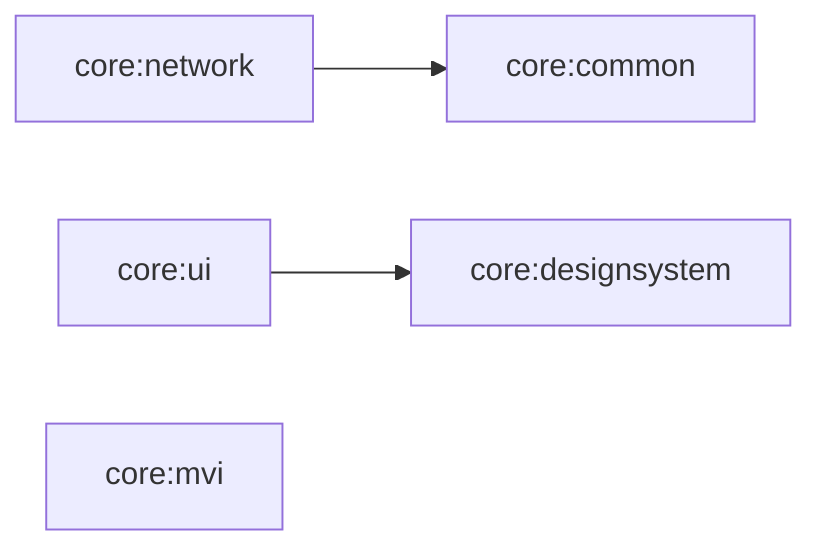

# Core 모듈 그룹

여러 feature에서 공유하지만 feature나 app에는 의존하지 않는 기반 모듈입니다.

## 구성

| 모듈 | 책임 |
|---|---|
| `core:common` | Android 비의존 공통 Kotlin 코드 |
| `core:network` | Retrofit 호출 실행과 공통 네트워크 오류 분류 |
| `core:designsystem` | Theme와 디자인 구성요소 |
| `core:ui` | Design system을 조합한 공통 UI |
| `core:mvi` | MVI 계약과 base ViewModel (서드파티 라이브러리 미사용) |

Core에는 특정 feature의 문구, route, 비즈니스 흐름을 두지 않습니다. 두 개 이상의 feature에서 재사용되고 안정적인 공통 계약일 때만 core로 이동합니다.

## 문서

- [Common](common/README.md)
- [Network](network/README.md)
- [Design System](designsystem/README.md)
- [UI](ui/README.md)
- [MVI](mvi/README.md)
