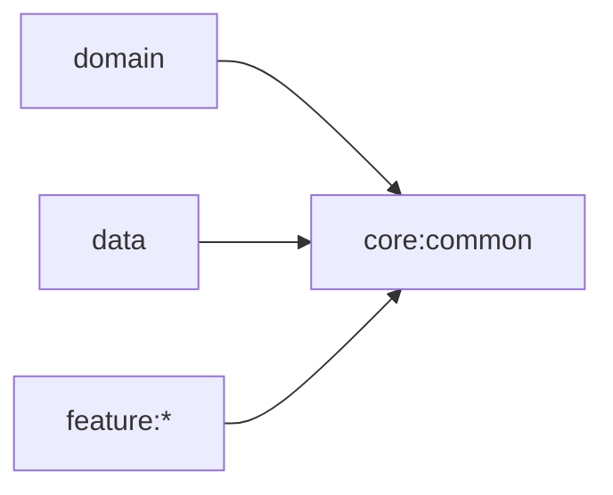

# Core Common 모듈

## 목적

Android에 의존하지 않는 공통 Kotlin 타입과 coroutine 기반 요소를 제공합니다.



- 다른 프로젝트 모듈에 의존하지 않습니다. Kotlin 표준 라이브러리와 coroutine 같은
  일반 라이브러리 의존성은 허용합니다.
- Android `Context`, Compose, feature 전용 모델을 두지 않습니다.
- Convention Plugin: `blebridge.kotlin.jvm`
- `NeveraResult`와 공통 `NetworkError`를 제공합니다.

```bash
./gradlew :core:common:test
```
