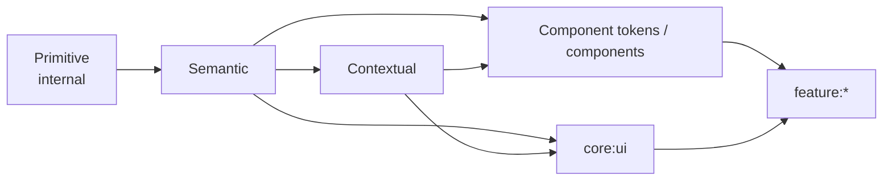

# Core Design System 모듈

Compose 디자인 foundation과 역할·동작 상태·채팅 모드에 따른 표현 context를 제공합니다.
실제 컴포넌트 구현과 화면 조립은 이 모듈의 공개 토큰을 조합하되 Primitive에는 접근하지
않습니다.

## 책임

- `AppTheme`: 앱 전체 Light/Dark foundation과 공개 토큰 진입점
- `primitive`: raw 색상·폰트 리소스. 모듈 내부 `internal`
- `semantic`: 색상, 타이포그래피, spacing, radius, size, motion, gradient
- `contextual`: Connection role, BLE activity, Chat mode 매핑
- `component`: 디자인시스템 소유 컴포넌트군의 전용 토큰
- `icon`: 색상을 내장하지 않은 `AppIcons`



Feature는 `AppTheme.colors` 같은 foundation을 직접 조립하지 않고 완성된 컴포넌트 API와
컴포넌트가 공개한 token만 사용합니다. 이 경계는 `:lint:designsystem`이 검사합니다.

## 기준 문서

- [디자인시스템 상세 가이드](../../docs/design-system/README.md)
- [최종 디자인과 토큰 레퍼런스](../../docs/design/BLETransferApp.dc.html)
- [공통 컴포넌트 구현 프롬프트](../../docs/design/common)
- [core:ui 컴포넌트 구현 프롬프트](../../docs/design/ui)
- [Custom lint](../../lint/README.md)

## 검증

```bash
./gradlew :core:designsystem:compileDebugKotlin
./gradlew :core:designsystem:assembleDebugAndroidTest
./gradlew :core:designsystem:connectedDebugAndroidTest # emulator/device 필요
```
