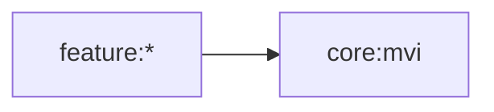

# Core MVI 모듈

## 목적

모든 feature가 동일한 Intent, Mutation, UiState, SideEffect 흐름을 사용하도록 MVI 계약과 base ViewModel을 제공합니다. 서드파티 MVI 라이브러리(Orbit)에 의존하지 않고 `MutableStateFlow` + `Channel`로 직접 구현되어 있습니다.



## 공개 계약

- `MviState`
- `MviIntent`
- `MviMutation`
- `MviSideEffect`
- `MviViewModel`

이 모듈은 feature, domain, data, app을 참조하지 않습니다. Convention Plugin은 `blebridge.android.library`이며, `MviViewModel`이 `@Composable` 함수(`collectAsState`, `collectSideEffect`)를 직접 제공하기 위해 Compose Runtime과 `lifecycle-runtime-compose`를 `api`로 추가했습니다.

```bash
./gradlew :core:mvi:testDebugUnitTest
```

## 패키지/파일 구조 컨벤션

화면 하나당 아래 5개 파일을 `model` 패키지 아래에 둡니다. `feature:splash`처럼 화면이 `<screen>/` 서브패키지로 분리된 모듈에서는 이 구조가 `<screen>/` 아래에 위치합니다(`feature:main`처럼 flat한 모듈은 `feature.<feature>` 루트에 바로 옵니다). 두 구조의 선택 기준은 [`feature/README.md`](../../feature/README.md#패키지-구조-컨벤션)를 참고하세요.

```
feature/splash/src/main/kotlin/.../feature/splash/main/
├── SplashViewModel.kt
└── model/
    ├── SplashUiState.kt
    ├── SplashIntent.kt
    ├── SplashMutation.kt
    └── SplashSideEffect.kt
```

## 네이밍 컨벤션

- 계약 인터페이스는 `Mvi` 프리픽스를 사용합니다: `MviState`, `MviIntent`, `MviMutation`, `MviSideEffect`, `MviViewModel`.
- 구현 타입은 `<Screen>` 또는 `<Feature>` 프리픽스(어느 쪽인지는 [`feature/README.md`](../../feature/README.md#패키지-구조-컨벤션)의 모듈 구조를 따름) + 역할 접미사로 짓고, 대응하는 `Mvi*` 계약을 구현합니다: `SplashUiState : MviState`, `SplashIntent : MviIntent`.
- `BleBridge` 프리픽스는 앱 루트의 `BleBridgeApp`, `BleBridgeApplication`에만 사용합니다.
  MVI 구현 타입은 화면 또는 feature 역할 이름으로 구분합니다.

## 구현 가이드

`feature:splash`를 최소 템플릿으로 참고하세요.

```kotlin
// model/SplashUiState.kt
data class SplashUiState(
    val isLoading: Boolean = true,
) : MviState

// model/SplashIntent.kt
sealed interface SplashIntent : MviIntent {
    data object Initialize : SplashIntent
}

// model/SplashMutation.kt
sealed interface SplashMutation : MviMutation {
    data object Ready : SplashMutation
}

// model/SplashSideEffect.kt
sealed interface SplashSideEffect : MviSideEffect {
    data object NavigateToMain : SplashSideEffect
}

// SplashViewModel.kt
@HiltViewModel
class SplashViewModel @Inject constructor(
    ...
) : MviViewModel<SplashUiState, SplashSideEffect, SplashIntent, SplashMutation>(
    SplashUiState(),
) {
    override fun handleIntent(intent: SplashIntent) {
        when (intent) {
            SplashIntent.Initialize -> initialize()
        }
    }

    private fun initialize() {
        intent {
            applyMutation(SplashMutation.Ready)
            postSideEffect(SplashSideEffect.NavigateToMain)
        }
    }

    override fun reduce(state: SplashUiState, mutation: SplashMutation): SplashUiState =
        when (mutation) {
            SplashMutation.Ready -> state.copy(isLoading = false)
        }
}
```

Composable Route에서는 `viewModel.collectAsState()` /
`viewModel.collectSideEffect { }`를 사용하고, 수집한 상태와 callback만 Screen에
전달합니다. 자세한 경계는
[`docs/feature/README.md`](../../docs/feature/README.md)를 참고합니다.

## 강제되는 것 / 컨벤션으로만 지키는 것

- **강제됨(컴파일 에러)**: `reduce`는 `MviViewModel` 내부 `private`이 아니라 `protected abstract fun reduce(state, mutation): STATE`로만 존재하고, `intent { }` 블록이 받는 `MviActionScope`에는 `state`/`applyMutation`/`postSideEffect`만 노출됩니다. `reduce`를 직접 호출하는 코드 경로 자체가 없어서, state 변경은 반드시 `applyMutation`을 거칩니다.
- **Do** UI/Compose로부터의 모든 요청은 `handleIntent`를 거쳐 `INTENT`로만 들어오게 합니다.
- **Do** 일회성 이벤트(네비게이션, 토스트 등)는 state가 아니라 `SIDE_EFFECT`로 표현합니다.
- **Don't** `MviState`/`MviIntent`/`MviMutation`/`MviSideEffect`를 하나의 sealed 타입에 겸용하지 않습니다. 역할별로 분리된 타입을 유지합니다.

## 테스트 컨벤션

[docs/test/README.md](../../docs/test/README.md)를 따릅니다.
