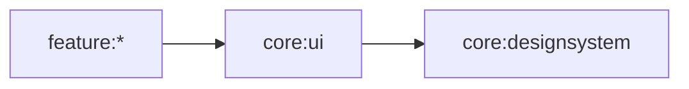

# Core UI 모듈

## 목적

Design system을 조합한 로딩, 오류, 빈 상태 등 공통 UI 패턴을 제공합니다.



- 허용: 여러 feature에서 재사용하는 상태 없는 UI 패턴
- 금지: feature route, ViewModel, domain/data 접근
- Convention Plugin: `blebridge.android.compose`

## 주요 구성

- `LoadingContent`: 화면 전체를 채우는 중앙 정렬 `CircularProgressIndicator`
- `CatFactItem`: debug sample 화면을 지원하는 임시 공용 컴포넌트. 제품 컴포넌트
  카탈로그의 구현 대상으로 간주하지 않습니다.
- `SplashContent`: 고정 브랜드 Splash 표현을 완성된 형태로 제공하는 public
  compound component

### Splash 컴포넌트 경계

```text
component/splash/
├── SplashContent.kt  # public · Feature가 사용하는 유일한 진입점
├── SplashBrandContent.kt      # internal
├── SplashLogo.kt              # internal
├── LoadingDots.kt             # internal
├── LoadingDot.kt              # internal
├── SplashTokens.kt   # internal Component token
└── SplashDefaults.kt # internal 애니메이션 규칙
```

`feature:splash`는 `isLoading`, `versionLabel`과 지역화 문자열만 전달합니다.
`SplashUiState`, ViewModel, navigation, 시스템 바는 Feature가 소유하며 `core:ui`는
Feature 타입이나 리소스를 참조하지 않습니다. 배경, 로고, pulse, 로딩 표시와 버전 배치는
`SplashContent`가 캡슐화합니다.

Feature의 `Route → Screen → 선택적 Content` 경계는
[`docs/feature/README.md`](../../docs/feature/README.md)를 따르며, 일반 컴포넌트의 상세
구현 계약은 [`docs/design/ui`](../../docs/design/ui) 프롬프트를 기준으로 합니다.

```bash
./gradlew :core:ui:testDebugUnitTest :core:ui:assembleDebugAndroidTest
```

## util 패키지

`util` 하위 패키지(`com.jackson.blebridge.core.ui.util`)에는 컴포저블은 아니지만
Compose UI 계층에서 반복적으로 필요한 Android 프레임워크 유틸리티(예: `Context.findActivity()`)를 둡니다.

- 이 모듈은 "컴포저블 전용"이 아니라 "Compose UI 계층이 쓰는 공용 코드"로 범위를 넓게 봅니다.
- 다만 이런 유틸이 늘어나 컴포저블과 성격이 뚜렷이 구분되는 그룹으로 커지면, 그때 `core:android`(Compose 비의존, Android SDK 의존 모듈)로 분리하는 것을 고려합니다. 지금은 항목이 적어 모듈을 미리 나누지 않습니다.
