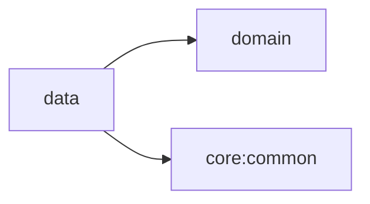

# Data 모듈

## 목적

Domain repository 계약을 구현하고 datasource, mapper, 영속화 및 DI binding을 소유합니다.

## 의존성



- 허용: domain 계약 구현, Android 기반 datasource, Hilt binding
- 금지: feature, app, Compose 화면
- `app`은 Hilt graph 조립을 위해 data를 포함하지만 data는 app을 참조하지 않습니다.

## 주요 구성

- `provider.AndroidAppInfoProvider`: `domain`의 `AppInfoProvider`를 `PackageManager` 기반으로 구현합니다.
- `di.ProviderModule`: `AppInfoProvider` 등 provider 구현체를 Hilt `SingletonComponent`에 바인딩합니다.
- BLE 데이터 기능(repository, datasource, mapper)은 아직 구현 전입니다.
- `data:sample`: Cat Facts Retrofit API, DTO mapper, repository 구현과 Hilt binding을 제공합니다.
  random fact 호출은 `ApiCallExecutor`로 공통 오류를 분류한 뒤 data mapper에서 HTTP status를
  domain failure로 변환합니다. app의 debug variant에만 포함됩니다.
- Convention Plugin: `blebridge.android.library`, `blebridge.android.hilt`

## 테스트

Repository와 datasource가 추가되면 로컬 단위 테스트를 우선하며 coroutine 동작은 가상 시간으로 검증합니다.

```bash
./gradlew :data:testDebugUnitTest
./gradlew :data:sample:testDebugUnitTest
```
