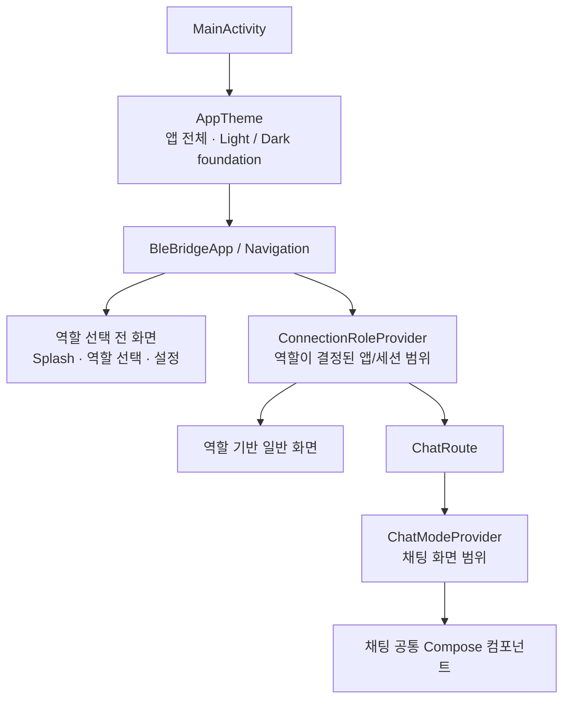

# 디자인시스템 상세 가이드

BleBridge의 Compose 디자인 foundation과 화면 표현 context를 제공합니다. 토큰은
`Primitive → Semantic/Contextual → Component` 계층으로 관리합니다. Primitive는
`internal`로 숨기고, `core:designsystem`과 `core:ui`의 컴포넌트 Defaults/Tokens가 공개
Semantic/Contextual 토큰을 조합합니다. Feature는 완성된 Component API와 필요한
Component token만 사용합니다.

토큰의 디자인 기준은 [`docs/design/BLETransferApp.dc.html`](../design/BLETransferApp.dc.html)
전체 화면입니다. HTML 상단 샘플 팔레트만 보지 않고 연결, 설정, 미디어, Light/Dark
채팅 3개 모드에 실제 반복되는 앱 UI 값을 역추출합니다. 문서 캔버스와 휴대폰/태블릿
프레임 색은 앱 토큰에 포함하지 않습니다.

## 디자인 구조

Light/Dark, BLE 역할, 채팅 표시 모드는 서로 다른 책임을 갖는 독립 축입니다. 표시 모드별로 완전한 Theme를 복제하지 않고 필요한 context만 조합합니다.



| 축 | 책임 | 변경되는 값 |
|---|---|---|
| Light/Dark | 앱 전체 명암 환경 | 배경, surface, text, border, status container |
| Server/Client | 현재 BLE 역할 | active/peer role 색상, Material primary/secondary |
| Chat mode | 채팅 표현 방식 | typography, 밀도, radius, chrome, metadata 노출 |

`AppTheme`의 기본 Material primary는 브랜드의 기본 accent로 Server 색상을 사용합니다. 이는 현재 앱 역할이 Server로 선택되었다는 뜻이 아닙니다. 실제 BLE 역할은 역할 선택이나 연결 세션 상태가 결정된 뒤 `ConnectionRoleProvider`로 별도 제공합니다.

Provider의 권장 배치 범위는 다음과 같습니다.

| Provider | 권장 위치 | 이유 |
|---|---|---|
| `AppTheme` | `MainActivity.setContent` | 모든 화면이 공유하는 Light/Dark foundation |
| `ConnectionRoleProvider` | `BleBridgeApp`의 역할 결정 이후 navigation/session 범위 | 현재 역할에 따른 앱 공통 accent와 active/peer 색상 |
| `ChatModeProvider` | `ChatRoute` | 채팅에만 필요한 밀도, chrome, telemetry 노출 정책 |
| `ChatContext` | Preview, UI test, 독립 채팅 화면 | Role과 Chat mode provider를 한 번에 조합하는 편의 API |

## 토큰 구성

```text
theme/
├── AppTheme.kt
├── primitive/      # internal raw 값
│   ├── color/      # ColorPalette
│   └── typography/ # internal FontFamily 리소스
├── semantic/       # UI 의미로 이름 붙인 공개 foundation
│   ├── color/
│   ├── typography/
│   ├── spacing/
│   ├── radius/
│   ├── iconsize/
│   ├── size/
│   ├── gradient/
│   └── motion/
├── contextual/     # 역할·동작 상태·채팅 모드에 따른 조합 정책
│   ├── activity/
│   ├── role/
│   └── chat/
└── component/      # 특정 컴포넌트군 전용 토큰
    └── media/

icon/
└── AppIcons.kt
```

### 계층별 의존 규칙

| 계층 | 공개 범위 | 참조 가능 대상 | 금지 사항 |
|---|---|---|---|
| Primitive | `internal` | 같은 모듈의 Semantic/Contextual/Component 조립 코드 | `core:ui`, Feature 직접 참조 |
| Semantic | public | `core:designsystem`, `core:ui`의 Defaults/Tokens | Feature 화면에서 직접 조립 |
| Contextual | public | 역할·상태·모드 provider와 Defaults/Tokens | Domain 모델을 직접 의존 |
| Component | 필요한 API만 public | Component 구현과 Feature 조립 | raw `Color`, `TextStyle`, 임의 dp 노출 |

Semantic과 Contextual은 같은 단계의 공개 foundation입니다. Semantic은
`textPrimary`, `screenTitle`, `progressRotationMillis`처럼 보편적 UI 의미를 소유하고,
Contextual은 Server/Client, BLE activity, 채팅 표시 모드처럼 런타임 문맥에 따른 매핑
정책을 소유합니다.

현재 `Spacing.section/screen`은 크기 단계가 아니라 레이아웃 용도의 Semantic
token입니다. 컴포넌트 구현 전까지 유지하며 실제 모바일·태블릿 화면에서 각각
`sectionSpacing`, `screenHorizontalPadding` 의미가 맞는지 검증한 뒤 이름을 확정합니다.
특정 Scaffold에서만 변경되는 값으로 확인된 경우에만 해당 Component Tokens로 이동합니다.

`Radius.card/bubble/input/logo`도 현재는 구현 프롬프트가 참조하는 Semantic
alias로 유지합니다. 다음 컴포넌트가 구현될 때 소유권을 함께 검토합니다.

| Radius alias | 구현 시 함께 검토할 대상 |
|---|---|
| `card` | Empty State, Settings Field, Device List Item, ChatTokens.cardRadius |
| `bubble` | Message Bubble, ChatTokens.bubbleRadius |
| `input` | Choice Dialog, Chat Input 및 입력 계열 컴포넌트 |
| `logo` | Splash/Logo, Attachment Sheet 상단 shape |

하나의 컴포넌트군에서만 독립적으로 변경되는 값이고 해당 Defaults/Tokens가 실제 생성된
뒤에만 Component 계층으로 이동합니다. 여러 컴포넌트가 같은 규칙으로 함께 변경된다면
Semantic alias로 유지하거나 이름만 구체화합니다. 이동 또는 이름 변경은 Kotlin 참조,
Material Shapes, 테스트, `docs/design/common`, `docs/design/ui`, HTML의 표시·다운로드
JSON을 한 작업에서 함께 갱신해야 합니다.

`iconSize.actionContainer/logo/splash` 역시 컴포넌트 구현 시 해당 Defaults/Tokens로
이동할 후보입니다.

### Color

`ColorPalette`는 HTML에서 추출한 raw 값이며
`theme/primitive/color`의 `internal` API입니다. Light/Dark 의미 매핑은
`theme/semantic/color/AppColors.kt`가 담당합니다. 외부 모듈에서는
`AppTheme.colors`, `roleColors`, `chatTokens.colors`만 사용합니다.

- 배경: `backgroundPrimary`, `backgroundSecondary`
- 표면: `surfacePrimary`, `surfaceSecondary`, `surfaceVariant`, `inputBackground`
- 경계: `borderNormal`, `borderSubtle`, `borderStrong`
- 콘텐츠: `textPrimary`, `textSecondary`, `textTertiary`, `textPlaceholder`, icon 계열
- 역할: Server/Client의 accent, container, on-color
- 상태: success, warning, error와 container/on-container
- BLE 동작 상태: idle, connecting, advertising, scanning
- 비활성: disabled content/container/border
- 오버레이: scrim

주요 역할색은 다음과 같습니다.

| Role | Light | Dark | on-color |
|---|---|---|---|
| Server | `#2563EB` | `#4F8DFF` | Light는 white, Dark는 `#0B0D12` |
| Client | `#0E9488` | `#2DD4BF` | `#0B0D12` |

Light Client의 on-color는 원본의 흰색 대신 어두운 색을 사용합니다. `#0E9488` 위 흰색은 일반 텍스트 WCAG AA 대비를 충족하지 못하지만 `#0B0D12`는 충족합니다.

BLE 동작 상태는 역할과 별개의 의미 축입니다. Server는 역할이고 Advertising은 현재 동작이므로 같은 토큰으로 취급하지 않습니다.

| Activity | Light accent | Container | 의미 |
|---|---|---|---|
| Idle | disabled icon | disabled container | 시작 전·중지 |
| Connecting | Server accent | Server container | GATT 연결 진행 |
| Advertising | `#7C3AED` | `#F0EAFB` | Peripheral 광고·대기 |
| Scanning | Client accent | Client container | 주변 서버 검색 |

`AppTheme.activityColors.forStatus(status)`로 상태별 accent/container/content/border를 가져옵니다.

### Typography

- `AppFontFamilies`: `theme/primitive/typography`의 `internal` 폰트 리소스
- `AppTypography`: `theme/semantic/typography`의 공개 의미 스타일이며 각 스타일의
  크기·행간·굵기·자간을 직접 소유
- UI 문장: Pretendard Variable 400/500/600/700
- MTU, chunk, 속도, 시간, `[S]/[C]`, terminal log: JetBrains Mono Variable 400/500/600
- UI style: `headline`, `screenTitle`, `titleLarge/Medium/Small`, `bodyLarge/Medium`, `labelLarge/Medium/Small`
- Telemetry style: `monoTitle/Large/Medium/Small`

JetBrains Mono는 시스템 monospace fallback이 아니라 모듈에 포함된 실제 font를 사용합니다.
라이선스는 [`JETBRAINS_MONO_OFL.txt`](../../core/designsystem/JETBRAINS_MONO_OFL.txt)를
참고합니다.

`size10`, `line20`처럼 숫자만 이름으로 갖는 원시 타이포그래피 scale은 만들지 않습니다.
현재 크기와 행간은 여러 독립 토큰을 조립하는 공용 scale이 아니라 완성된 Semantic
`TextStyle`의 계약이므로 `AppTypography`에서 직접 관리합니다.

### Spacing, radius, size

- Spacing: `0, 2, 4, 6, 8, 10, 12, 16, 20, 24, 32, 40, 48dp`
- Radius: `0, 4, 6, 8, 10, 12, 14, 16, 20, 24dp, full`
- Icon size: `16, 18, 20, 24, 30, 36, 40, 52, 104dp`
- Control size: compact `38dp`, default `40dp`, comfortable `42dp`
- Minimum touch target: `48dp`

Control size는 보이는 컨테이너 크기입니다. 공통 컴포넌트는 시각 크기와 별개로 최소 `48dp` 터치 영역을 보장해야 합니다.

### Motion과 gradient

- Progress rotation: `1,000ms`
- Waiting rotation: `1,400ms`
- Client pulse: `2,000ms`
- Brand/server pulse: `2,400ms`
- Activity pulse geometry: scale `0.6 → 2.6`, alpha `0.15`
- Brand gradient: `#2563EB → #1D4ED8`

시간·easing·pulse geometry는 `AppTheme.motion`의 Semantic 토큰입니다.
상태별 pulse 적용 정책은 `AppTheme.activityMotion.usesPulse(status)`가 소유합니다.
Pulse는 `Advertising`과 `Scanning`에서만 사용합니다. `Idle`과 `Connecting`에는 pulse를
적용하지 않으며 Connecting은 progress rotation을 사용합니다. 공통 컴포넌트 구현 시
시스템의 reduced-motion 설정을 존중하고 duration scale이 0이면 반복 애니메이션 없이
정적 상태를 표시합니다.

### 고정 Splash 표현

Splash는 앱의 Light/Dark 설정과 무관하게 동일한 브랜드 화면을 사용하지만, 전용
Component token과 구현은 `core:ui`의 `SplashContent`가 소유합니다.
`core:designsystem`은 해당 컴포넌트가 조합하는 typography, brand gradient, motion
easing과 Logo icon만 제공합니다. Feature는 상태와 지역화 문자열을 전달하고 시스템 바와
내비게이션을 담당합니다.

이미지·영상 상세도 앱 Theme와 무관한 고정 dark presentation입니다.
`AppTheme.media`의 `chromeBackground`, `content`, `mutedContent`, `controlTrack`,
`controlProgress`, `scrim`을 사용하며 `colors.surfaceInverse`로 대체하지 않습니다.

## 표시 모드

기본값은 디자인 명세의 추천값인 `DeveloperHybrid`입니다.

| 모드 | Typography | Layout | Metadata |
|---|---|---|---|
| `Classic` | 메시지는 Pretendard | 16dp bubble, 여유 있는 11dp 간격, neutral peer bubble | 시간 중심, telemetry 숨김 |
| `DeveloperHybrid` | 메시지는 Pretendard, 정보는 JetBrains Mono | role tint bubble, 16dp bubble | role tag와 telemetry 표시 |
| `Terminal` | header/message/input 모두 JetBrains Mono (`monoTitle` header) | 10dp radius, 3dp 간격, compact control | `[S]/[C]` 및 통계 강조 |

Classic과 Developer Hybrid의 입력창은 `radius.full`을 사용하고, Terminal 입력창은
`radius.large`를 사용합니다.

Terminal의 header와 입력 chrome은 Light에서도 `#12141A` 기반의 고정 dark chrome을 사용합니다. 이는 앱 전체 Dark Theme가 아니라 `ChatTokens.colors`에 한정된 presentation color입니다.

## 적용 범위와 사용법

### 앱 root theme

`MainActivity`에서는 앱 전체 foundation만 설정합니다. 역할을 임의로 Server나 Client로 고정하지 않습니다.

```kotlin
setContent {
    AppTheme {
        BleBridgeApp()
    }
}
```

현재 프로젝트도 이 구조를 사용합니다. 아직 BLE 역할 선택과 채팅 기능이 구현되지 않았으므로 실행 경로에는 `ConnectionRoleProvider`가 연결되어 있지 않습니다.

### 역할이 결정된 앱 또는 세션 범위

역할 상태가 추가되면 역할이 실제로 결정된 navigation graph 또는 연결 세션 범위에 provider를 둡니다. 역할 선택 전 Splash나 선택 화면에 가짜 기본 역할을 주입하지 않습니다.

```kotlin
@Composable
fun ConnectedGraph(currentRole: ConnectionRole) {
    ConnectionRoleProvider(role = currentRole) {
        NavHost(/* 연결 이후 화면 */)
    }
}
```

이 범위의 Material component는 현재 역할의 accent를 사용하며 하위 화면은 `AppTheme.roleColors`에 접근할 수 있습니다.

### 모드와 무관한 화면

Splash, 연결, 설정, 상세 화면처럼 채팅 표시 모드와 무관한 화면은 root theme만 사용합니다.

```kotlin
AppTheme {
    Text(
        text = "BLE Bridge",
        color = AppTheme.colors.textPrimary,
        style = AppTheme.typography.titleLarge,
        modifier = Modifier.padding(AppTheme.spacing.screen),
    )
}
```

### 채팅 표시 모드가 필요한 화면

```kotlin
@Composable
fun ChatRoute(displayMode: ChatMode) {
    // 상위 ConnectedGraph의 ConnectionRoleProvider 안에서 호출됩니다.
    ChatModeProvider(mode = displayMode) {
        val role = AppTheme.roleColors
        val chat = AppTheme.chatTokens

        MessageBubble(
            color = role.active,
            textStyle = chat.messageTextStyle,
            radius = chat.bubbleRadius,
        )
    }
}
```

`Classic`, `DeveloperHybrid`, `Terminal`은 채팅 화면의 표현 정책이므로 앱 root가 아니라 `ChatRoute` 범위에서 설정합니다. 설정값은 Feature의 UI state가 소유하고 `ChatMode`로 변환합니다.

### Preview와 UI test

`ChatContext`는 내부에서 역할과 표시 모드 provider를 순서대로 조합하는 편의 API입니다. 앱의 주 실행 경로에서 상태 범위를 합치는 용도가 아니라, 두 상태를 한 번에 준비해야 하는 Preview, UI test, 독립 채팅 화면에 적합합니다.

```kotlin
AppTheme {
    ChatContext(
        role = ConnectionRole.Server,
        mode = ChatMode.DeveloperHybrid,
    ) {
        ChatScreen(/* preview/test state */)
    }
}
```

역할만 필요한 연결 화면에서는 다음처럼 범위를 좁힐 수 있습니다.

```kotlin
ConnectionRoleProvider(role = ConnectionRole.Client) {
    val active = AppTheme.roleColors.active
}
```

### 아이콘

아이콘에는 색상이 내장되어 있지 않습니다. `Icon`의 `tint`로 semantic color를 전달합니다.

```kotlin
Icon(
    imageVector = AppTheme.icons.Send,
    contentDescription = "전송",
    tint = AppTheme.roleColors.onActive,
    modifier = Modifier.size(AppTheme.iconSize.small),
)
```

제공 아이콘:

- 앱/탐색: Logo, Back, Close, More, Settings, SwitchRole
- BLE/기기: DevicePhone, SignalStrength
- 액션: Add, Send, Chat, Play, Pause, Stop, Retry, Check, Error, Download
- 미디어: File, Image, Video, Camera, SkipBackward, SkipForward

`Settings`는 최종 디자인의 기어 glyph입니다. 이 목록의 23개 공개 벡터는
`BLETransferApp.dc.html`의 다운로드 가능 SVG 카드와 동기화하며, Logo는 문서의 별도
로고 카드에서 관리합니다. `SwitchRole`은 연결·설정 흐름에서만 사용할 수 있고 채팅
상세 AppBar에는 배치하지 않습니다.

## 구현 대상 컴포넌트

`01A · COMPONENT CATALOG` 기준 구현 순서는 다음과 같습니다. 컴포넌트 구현 전까지
상세 계약은 `docs/design/common`의 같은 번호 프롬프트를 기준으로 합니다.

1. Action Button
2. Icon Button
3. Segmented Control
4. Activity Indicator
5. Status Banner
6. Empty State
7. Choice Dialog
8. Settings Field
9. Adaptive Two Pane
10. App Bar
11. Media Playback Controls

BLE·채팅·전송 의미를 포함하는 Device List Item, Chat Chrome, Message Bubble,
Transfer Card, Chat Input, Attachment Sheet는 `core:ui`에 구현합니다.

## 개발 규칙

- Primitive 타입과 값은 반드시 `internal`로 제한하며 `primitive` 패키지 밖의 공개 API
  시그니처에 노출하지 않습니다.
- `core:designsystem`과 `core:ui`의 컴포넌트 Defaults/Tokens만 공개
  Semantic/Contextual 토큰을 조합합니다.
- Feature는 화면을 Component API와 Component token으로 조립합니다.
  `AppTheme.colors` 등 foundation을 직접 조합하는 방식은 새 코드에서 사용하지
  않습니다.
- Feature에서는 hex color, FontFamily, raw dp/sp를 직접 정의하지 않습니다.
- `core:ui`의 Component Tokens는 대응하는 Semantic token이 없고 특정 컴포넌트에만
  의미가 있는 고정 크기·간격을 직접 소유할 수 있습니다. 다만 foundation 값을 복제하거나
  여러 컴포넌트에서 반복되는 값은 Semantic token으로 승격합니다.
- Server/Client는 송신/수신 방향이 아니라 현재 BLE 역할 의미로 사용합니다.
- Domain의 BLE 모델을 디자인시스템에 의존시키지 않습니다. Feature에서 `ConnectionRole`로 변환합니다.
- 표시 모드 설정 모델도 Feature 경계에서 `ChatMode`로 변환합니다.
- `AppTheme`에는 현재 역할을 의미하는 기본값을 넣지 않습니다. 역할이 결정된 범위에만 `ConnectionRoleProvider`를 적용합니다.
- 채팅 표시 모드는 앱 전체 theme가 아닙니다. `ChatModeProvider`를 `ChatRoute` 범위에 적용합니다.
- `ChatContext`는 Preview, UI test 또는 독립된 채팅 화면의 편의 API로 사용합니다.
- 일반 문장은 Pretendard, 기술 정보와 terminal log만 JetBrains Mono를 사용합니다.
- 화면 최상위 제목은 `screenTitle`, 일반 섹션 제목은 `title*` 계열을 사용합니다.
- AppBar는 `screenTitle`과 기존 spacing/control/icon-size 토큰을 조합하며, 높이처럼 컴포넌트 구조에만 필요한 값은 `AppBarDefaults`가 소유합니다.
- AppBar의 icon-only action은 visual size와 관계없이 `controlSize.minimumTouchTarget`을 보장하고, 일반 화면의 노출 action은 최대 2개를 권장합니다. 나머지는 overflow menu로 제공합니다.
- Server/Client 역할과 Idle/Connecting/Advertising/Scanning 동작 상태를 혼용하지 않습니다.
- 반복 애니메이션은 동작 중 상태에만 적용하고 reduced-motion 설정을 존중합니다.
- 모드 차이는 `when(mode)`를 각 컴포넌트에 반복하지 않고 `AppTheme.chatTokens`로 해결합니다.
- 컴포넌트 고유 상태가 여러 Feature에서 반복될 때만 새로운 semantic token을 추가합니다.
- Convention Plugin은 `blebridge.android.compose`를 사용합니다.
- 공개 또는 internal 리프 Compose 컴포넌트는 의미 있는 상태별 `@Preview`를 함께
  추가합니다. ViewModel을 주입받는 Route 컴포저블과 `SplashSystemBarsEffect`처럼 UI를
  그리지 않는 side-effect 전용 컴포저블은 예외입니다.

## 공통 컴포넌트 개발 경계

다음 단계의 Button, Banner, AppBar, MessageBubble, FileCard, ChatInput 등은 이 모듈 또는 `core:ui`에서 구현할 수 있습니다. 단순 시각 primitive와 AppBar layout은 `core:designsystem`, 채팅 모드처럼 앱 동작이나 모델 결합이 포함된 조합 UI는 `core:ui`에 둡니다.

공통 컴포넌트의 Defaults/Tokens는 다음 우선순위로 값을 소비합니다.

1. 채팅 표현값: `AppTheme.chatTokens`
2. 현재 역할값: `AppTheme.roleColors`
3. 전역 foundation: `AppTheme.colors`, typography, spacing, radius, size

`core:ui`의 `DeviceListItemDefaults.tokens(state)` 같은 상태 매핑 함수는
`core:ui` 내부에서 정의하고 해당 컴포넌트만 참조합니다. 여러 컴포넌트가 동일한 의미와
상태 매핑을 반복할 때만 `core:designsystem`의 Contextual 또는 Semantic 토큰 승격을
검토합니다.

Feature의 foundation 직접 참조, raw 디자인 값과 정책 대상 Material3 컴포넌트 사용은
`:lint:designsystem` custom lint가 `ERROR`로 차단합니다. 현재 공통 컴포넌트 구현 전부터
있던 위반만 feature별 baseline에 기록되어 있으며, 새 코드에는 baseline을 추가하지 않습니다.
규칙과 운영 방법은 [`lint/README.md`](../../lint/README.md)를 참고합니다.

## 검증

Android Compose test에서 다음을 검증합니다.

- Light/Dark foundation semantic color
- Light/Dark × Server/Client × Classic/DeveloperHybrid/Terminal 12개 조합
- 역할별 Material primary/secondary와 container mapping
- Idle/Connecting/Advertising/Scanning activity color mapping
- 모든 role/activity foreground 대비율
- 표시 모드별 typography, spacing, radius, chrome, metadata 정책
- typography, spacing, radius, icon/control size, gradient, motion foundation
- 제공 폰트와 필수 아이콘

```bash
./gradlew :core:designsystem:compileDebugKotlin
./gradlew :core:designsystem:assembleDebugAndroidTest
./gradlew :core:designsystem:connectedDebugAndroidTest # emulator/device 필요
./gradlew :app:assembleDebug :app:lintDebug
```
