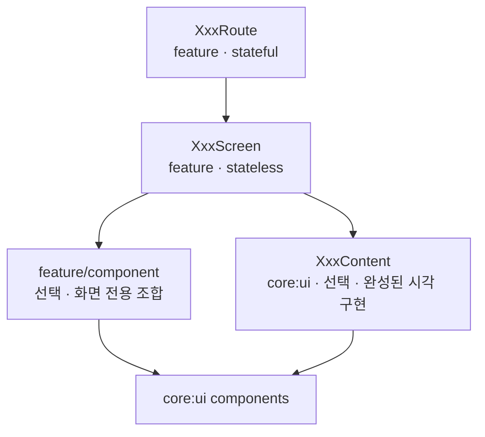

# Feature UI 구성 컨벤션

Feature 화면을 구현하고 유지보수할 때 사용하는 Compose UI 경계와 패키지 규칙입니다.
모든 화면은 `Route → Screen`을 필수 경계로 사용하고, 전체 시각 구현을 캡슐화할 필요가
있는 경우에만 `core:ui`의 `Content`를 선택적으로 사용합니다.

## 책임 흐름



필수 흐름은 `Route → Screen`입니다. `feature/component`와 `core:ui Content`는 서로
대체 관계가 아니며, 화면의 복잡도와 시각 구현 소유권에 따라 필요한 쪽만 사용합니다.

## Route

`XxxRoute`는 feature의 stateful 진입점입니다.

- `hiltViewModel()`로 ViewModel 주입
- `UiState` 수집
- 화면 최초 진입 Intent 전달
- SideEffect 수집
- 내비게이션 callback 연결
- `XxxScreen` 호출

Route는 화면 UI를 직접 그리지 않으며 Preview와 Compose UI 테스트 대상이 아닙니다.
`NavController`도 직접 받지 않고 이동 의도를 callback으로 외부에 전달합니다.

```kotlin
@Composable
fun SplashRoute(
    onNavigateToMain: () -> Unit,
    viewModel: SplashViewModel = hiltViewModel(),
) {
    val state by viewModel.collectAsState()

    LaunchedEffect(Unit) {
        viewModel.handleIntent(SplashIntent.Initialize)
    }

    viewModel.collectSideEffect { effect ->
        when (effect) {
            SplashSideEffect.NavigateToMain -> onNavigateToMain()
        }
    }

    SplashScreen(state = state)
}
```

## 화면 진입 초기화

화면 최초 진입에 딸린 비동기 로딩, 지연, SideEffect 발행은 ViewModel의 `init`이 아니라
`Route`의 `LaunchedEffect(Unit)`에서 명시적인 Intent로 요청합니다.

```kotlin
LaunchedEffect(Unit) {
    viewModel.handleIntent(SplashIntent.Initialize)
}
```

ViewModel `init`은 생성자 인자로 초기 `UiState`를 계산하는 순수 동기 초기화에만
사용합니다. 초기화 Intent는 테스트에서 호출 시점을 제어할 수 있고
`UI 요청 → ViewModel 처리`라는 단방향 흐름을 보존합니다.

`LaunchedEffect(Unit)`은 ViewModel 생명주기당 한 번이 아니라 Composition 진입마다
실행될 수 있으므로, Initialize 계열 Intent는 ViewModel에서 멱등성을 보장합니다.
진행 중 상태만으로 중복 실행을 막기 어려우면 별도 플래그를 사용합니다.

```kotlin
private var initializationStarted = false

private fun initialize() {
    if (initializationStarted) return
    initializationStarted = true

    intent {
        delay(SplashDefaults.DURATION_MILLIS)
        applyMutation(SplashMutation.Ready)
        postSideEffect(SplashSideEffect.NavigateToMain)
    }
}
```

## Screen

`XxxScreen`은 feature가 소유하는 stateless 화면 조립자입니다.

- `UiState`와 사용자 이벤트 callback만 받음
- ViewModel, Intent dispatcher, NavController를 받지 않음
- 문자열·리소스와 feature 상태를 UI 인자로 변환
- 화면 상태 분기와 화면 전용 레이아웃 담당
- `core:ui` 컴포넌트 또는 선택적 `XxxContent` 조립
- Preview와 Compose UI 테스트의 기본 대상

```kotlin
@Composable
internal fun SplashScreen(
    state: SplashUiState,
    modifier: Modifier = Modifier,
) {
    SplashContent(
        isLoading = state.isLoading,
        versionLabel = state.versionLabel,
        title = stringResource(R.string.splash_title),
        subtitle = stringResource(R.string.splash_subtitle),
        modifier = modifier,
    )
}
```

Screen은 feature의 `UiState`를 알 수 있지만, `core:ui`로 `UiState` 자체를 전달하지
않습니다. 필요한 값만 primitive value와 UI callback으로 풀어 전달합니다.

## core:ui Content

`XxxContent`는 전체 화면 또는 하나의 완성된 시각 영역을 캡슐화하는 선택적 compound
component입니다. 모든 Screen에 Content를 만들지 않습니다.

Content가 적합한 조건은 다음과 같습니다.

- 전체 시각 구성을 디자인시스템 관점에서 한곳에서 통제해야 함
- 여러 feature나 화면에서 동일한 완성형 구성을 재사용함
- 내부 하위 컴포넌트와 component token을 외부에 노출하지 않아야 함
- feature에는 상태와 리소스를 UI 인자로 매핑하는 책임만 남기는 것이 명확함

Content는 다음 항목을 참조하지 않습니다.

- feature의 `UiState`, Intent, SideEffect
- ViewModel
- NavController
- feature 모듈의 리소스 ID

Splash는 대표적인 Content 적용 사례입니다.

```text
SplashRoute             feature:splash · stateful
└── SplashScreen        feature:splash · stateless state mapping
    └── SplashContent   core:ui · 완성된 브랜드 시각 구현
```

반면 기기 연결 화면처럼 여러 독립 공통 컴포넌트를 화면 상태에 따라 조합하는 경우에는
별도의 `DeviceConnectionContent` 없이 Screen에서 직접 조립할 수 있습니다.

```text
DeviceConnectionRoute
└── DeviceConnectionScreen
    ├── AppBar
    ├── SegmentedControl
    ├── ActivityIndicator
    ├── DeviceListItem
    └── ActionButton
```

## feature/component 패키지

`component/` 패키지는 제거하지 않지만 모든 화면에 미리 만들지도 않습니다. Screen에서만
사용하는 UI 조각을 분리할 필요가 생겼을 때 생성합니다.

허용하는 책임은 다음과 같습니다.

- Screen이 너무 커지는 것을 막기 위한 화면 전용 섹션
- 복잡한 상태 분기 캡슐화
- layout primitive와 `core:ui` 컴포넌트 조합
- feature 상태를 `core:ui` 컴포넌트 인자로 매핑
- 독립적인 상태별 Preview가 필요한 화면 조각

각 Composable은 기본적으로 `internal`이며 파일 하단에 상태별 private Preview를 둡니다.

```text
feature/<feature>/<screen>/
├── XxxScreen.kt
├── XxxViewModel.kt
├── component/             # 필요할 때만 생성
│   ├── XxxHeader.kt
│   ├── XxxBody.kt
│   └── XxxErrorSection.kt
└── model/
```

다음 중 하나에 해당할 때 분리를 고려합니다.

- `XxxScreen.kt`가 대략 100~150줄 이상으로 커짐
- 의미 있는 독립 화면 섹션이 존재함
- 상태 분기가 중첩되어 Screen의 흐름을 읽기 어려움
- 동일 Screen 안에서 UI 조합이 반복됨
- 독립적인 Preview 또는 UI 테스트가 유용함

단순히 파일 수를 맞추기 위해 한두 줄짜리 wrapper를 만들지는 않습니다.

## core:ui 승격 기준

feature component가 다음 조건에 해당하면 `core:ui`로 승격합니다.

- 둘 이상의 feature에서 사용됨
- 독립적인 component token 또는 Defaults가 필요함
- 디자인시스템이 상태·크기·색상·모션·접근성 정책을 통제해야 함
- 구현 세부사항을 feature로부터 완전히 숨기는 것이 유리함
- HTML component catalog에 공통 또는 일반 컴포넌트로 정의되어 있음

승격 이후 feature에는 `UiState → component parameter` 매핑과 이벤트 callback만 남깁니다.

## feature/component 금지사항

feature 전용 component도 feature 디자인시스템 lint 경계를 그대로 따릅니다.

- `AppTheme.colors`, `spacing`, `radius`, `typography` 등 foundation 직접 참조 금지
- raw `Color`, `.dp`, `.sp` 금지
- 정책 대상 Material3 컴포넌트 직접 사용 금지
- ViewModel과 NavController 전달 금지
- 다른 feature에서 직접 import 금지
- 공유 목적의 public Composable 정의 금지

레이아웃을 위한 `Row`, `Column`, `Box`, `LazyColumn`, `Modifier`와 표현 primitive인
`Text`, `Icon`은 허용합니다. 실제 스타일과 동작 정책은 `core:ui` 컴포넌트 또는 공개된
component API/token을 통해 전달받습니다.

## 파일과 테스트 네이밍

| 역할 | 파일/함수 | 공개 범위 | 기본 테스트 |
|---|---|---|---|
| Stateful 진입점 | `XxxScreen.kt` / `XxxRoute` | navigation에서 접근 가능한 범위 | ViewModel 단위 테스트 |
| Stateless 화면 | `XxxScreen.kt` / `XxxScreen` | `internal` | Compose UI 테스트, Preview |
| 화면 전용 조각 | `component/XxxSection.kt` | `internal` | 필요 시 Compose UI 테스트, Preview |
| 완성형 공통 UI | `core:ui/.../XxxContent.kt` | feature가 사용할 수 있도록 public | core:ui UI 테스트, Preview |

UI 테스트 파일은 `XxxScreenTest.kt`로 이름 짓고 ViewModel/Hilt 없이 `XxxScreen`을 직접
렌더링합니다.

`XxxScreen.kt`에는 Route와 Screen 외에도 해당 화면에만 필요한 private Effect와 private
Preview를 함께 둘 수 있습니다. 재사용 가능한 UI 섹션을 private 함수로 계속 누적하지 않고,
앞의 분리 기준을 충족하면 `component/`로 이동합니다.

## 빠른 판단 기준

```text
ViewModel 또는 SideEffect가 필요한가?
└── Route

feature UiState를 화면으로 표현하는가?
└── Screen

한 화면에서만 쓰는 복잡한 섹션인가?
└── feature/component

공유되거나 디자인 정책을 소유하는 완성형 UI인가?
└── core:ui component 또는 Content
```
