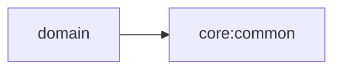

# Domain 모듈

## 목적

Android에 독립적인 비즈니스 모델, repository 계약, use case를 소유합니다.

## 의존성



- 허용: Kotlin/JVM, coroutine, `core:common`
- 금지: Android API, Compose, data 구현, DTO, feature, app
- repository는 인터페이스만 정의하고 구현은 `data`에 둡니다.

## 주요 API

- `provider.AppInfoProvider`: 앱 버전명/패키지명을 노출하는 계약. Splash 화면의 버전 표기에 사용되며, 구현체는 `data`에 있습니다(`AndroidAppInfoProvider`).
- BLE 도메인 기능(repository 계약, use case)은 아직 구현 전입니다.
- `domain:sample`: Paging/Android 타입에 의존하지 않는 Cat Fact 페이지·random fact 오류
  모델, repository 계약, use case를 제공합니다. app의 debug Sample 의존 그래프에서만 사용됩니다.
  random fact 결과는 `NeveraResult<CatFact, RandomCatFactFailure>`로 표현합니다.
- Convention Plugin: `blebridge.kotlin.jvm`

## 테스트

BLE use case가 추가되면 비즈니스 규칙과 repository 협력 동작을 JUnit 5와 coroutines-test로 검증합니다.

```bash
./gradlew :domain:test
./gradlew :domain:sample:test
```
