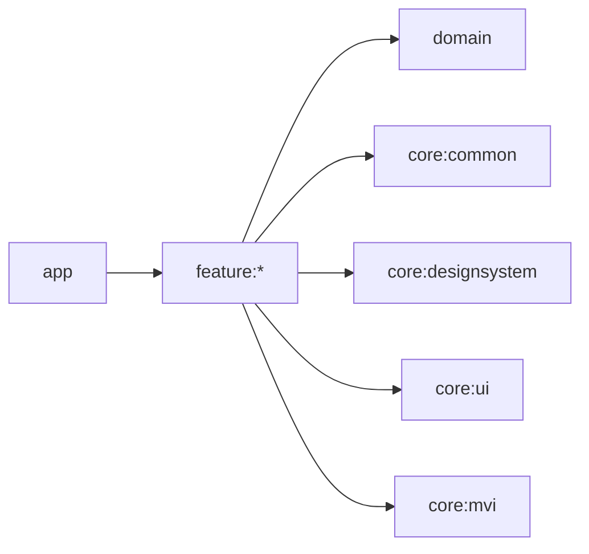

# Feature 모듈 그룹

사용자 화면 단위의 독립 Android library 모듈입니다. 개별 feature에는 README를 만들지 않고 이 문서에서 공통 규칙과 목록을 관리합니다.

## 의존성



Feature는 data, app, 다른 feature를 직접 참조하지 않습니다. 다른 기능으로 이동해야 할 때 route callback이나 app NavHost를 사용합니다.

## 현재 모듈

| 모듈 | 책임 | 구조 |
|---|---|---|
| `feature:splash` | 앱 초기화 상태와 Main 이동 SideEffect | 도메인 화면 모듈 |
| `feature:main` | 앱의 Main 진입 화면 | 관제/컨테이너 모듈 |
| `feature:sample` | debug 전용 random Cat Fact 및 Paging 목록 예제 | 도메인 화면 모듈 |

"구조" 열의 두 값은 아래 "패키지 구조 컨벤션"의 분류를 그대로 가리킵니다.

## 공통 구성

모든 feature는 `blebridge.feature`를 적용합니다. 이 plugin은 Compose, Hilt, serialization, lifecycle, navigation, coroutine, MVI/domain/core 의존성과 Turbine 단위 테스트, Compose UI 테스트를 제공합니다.

화면은 공식 Compose 샘플과 같은 `Route/Screen` 경계를 사용합니다. `Route`가 ViewModel,
화면 진입 SideEffect, 내비게이션 callback을 연결하고 `Screen(uiState, callbacks)`은 상태를
표현하는 Composable로 유지합니다. Screen UI 테스트에서는 Hilt를 실행하지 않습니다.

`Route → Screen → 선택적 core:ui Content`의 책임, feature `component/` 분리 기준과
`core:ui` 승격 조건은 [`docs/feature/README.md`](../docs/feature/README.md)를 따릅니다.

## 패키지 구조 컨벤션

feature 모듈은 역할에 따라 두 가지 패키지 구조 중 하나를 따릅니다.

### 도메인 화면 모듈 (예: `feature:splash`)

같은 도메인 안에서 화면이 여러 개로 늘어날 수 있는 모듈입니다. 화면마다 `<screen>/` 서브패키지를 만들고 그 안에 `component/model`을 둡니다. **지금 화면이 하나뿐이어도 처음부터 `<screen>/` 패키지로 시작합니다.**

화면 이름은 그 화면의 역할을 설명하는 구체적인 키워드로 짓습니다(`permission`, `onboarding` 등). `main`은 화면을 설명하는 이름이 아니라 **"이 도메인의 기본 진입 화면"을 가리키는 예약어**이며, 각 도메인 화면 모듈의 첫 화면에만 씁니다(`feature:splash`의 `main`). 이후 같은 도메인에 화면이 추가되면 `main`을 재사용하지 말고 새 화면의 역할을 설명하는 이름으로 `<screen>/`을 나란히 추가합니다.

```
feature/<feature>/src/main/kotlin/.../<feature>/
├── <screen>/                       # 화면(도메인) 단위 패키지. feature:splash 기준 이름은 `main`
│   ├── <Screen>Defaults.kt         # 테스트 태그, 애니메이션/시간 등 튜닝 상수 (internal object)
│   ├── <Screen>Screen.kt           # <Screen>Route(stateful) + <Screen>Screen(stateless)만 위치
│   ├── <Screen>ViewModel.kt
│   ├── component/                  # 필요할 때만 생성
│   │   └── <SubComponent>.kt       # Screen 전용 조합 Composable + @Preview
│   └── model/
│       ├── <Screen>UiState.kt
│       ├── <Screen>Intent.kt
│       ├── <Screen>Mutation.kt
│       └── <Screen>SideEffect.kt
├── <another-screen>/               # 같은 도메인에 화면이 늘어나면 같은 구조로 나란히 추가
│   └── ...
└── navigation/
    └── <Feature>Navigation.kt       # 모듈 destination과 navigation route
```

- **`<Screen>Screen.kt`의 화면 역할 함수는 `<Screen>Route`(ViewModel을 연결하는
  stateful 진입점)와 `<Screen>Screen`(state와 callback만 받는 stateless Composable)으로
  제한합니다.** 이 파일에 필요한 private Effect와 Preview는 함께 둘 수 있습니다.
  작은 화면은 한 파일에서 완결하고, 분리 기준을 충족할 때만 `component/`를 생성합니다.
- **`component/`의 각 Composable은 `internal fun`으로 노출 범위를 좁히고, 파일 하단에
  `private` `@Preview` Composable로 상태별 미리보기를 함께 정의합니다.** 여러 Feature가
  공유하거나 시각 구현 전체를 캡슐화해야 하는 컴포넌트는 `core:ui`로 승격합니다.
  세부 판단 기준은 [`docs/feature/README.md`](../docs/feature/README.md)를 따릅니다.
- **`model/`**: [`core/mvi/README.md`](../core/mvi/README.md) 구현 가이드를 따르는 MVI 계약 구현체.
- **`<Screen>Defaults.kt`**: 테스트 태그(`XxxDefaults.XXX_TAG`)와 매직 넘버(딜레이, 애니메이션 duration 등)를 한곳에 모읍니다. Composable이나 ViewModel에 리터럴 상수를 직접 흩어두지 않습니다.
- **`navigation/`은 feature 루트에 두고 모듈 destination을 등록합니다.** 현재
  `feature:splash`, `feature:main`이 이 구조를 사용합니다. 화면 수가 많은 모듈에서
  destination 파일을 화면별로 나누더라도 패키지는 feature 루트 `navigation` 아래에
  유지합니다. 화면 간 이동은 callback으로 외부에 요청하고 app NavHost가 `navigate()`를
  조립합니다([`docs/navigation/README.md`](../docs/navigation/README.md) 참고).
  debug 예제인 `feature:sample`의 화면별 `main/navigation`, `cats/navigation`은 기존
  구조이며, 제품 feature의 신규 기준으로 복사하지 않습니다.

### 관제/컨테이너 모듈 (예: `feature:main`)

탭 연동, 딥링크 라우팅처럼 다른 화면·모듈을 host하는 역할의 모듈입니다. 도메인 화면이 늘어나는 구조가 아니므로 화면 서브패키지로 나누지 않고, 기존처럼 `<Feature>Defaults.kt / <Feature>Screen.kt / <Feature>ViewModel.kt / component / model / navigation`을 `feature.<feature>` 루트에 flat하게 둡니다. 이 모듈이 실제로 여러 독립된 도메인 화면을 담게 되면 그때 위 "도메인 화면 모듈" 구조로 전환합니다.

## 네비게이션 컨벤션

feature는 자신의 Route와 진입점만 정의하고, 실제 `NavController.navigate()` 호출은 app 모듈의 `BleBridgeApp.kt` NavHost에서만 처리합니다. Route/화면 등록 위치, 같은 모듈에 화면이 여러 개일 때의 처리 방식, app NavHost 연결 방법은 [`docs/navigation/README.md`](../docs/navigation/README.md)에서 다룹니다.

## 화면 진입 초기화

비동기 초기화는 ViewModel `init`이 아니라 `Route`의 `LaunchedEffect`에서 Intent로
요청하고, ViewModel은 재진입에 안전한 가드를 둡니다. 코드 예제와 이유는
[`docs/feature/README.md`](../docs/feature/README.md#화면-진입-초기화)를 따릅니다.

## 신규 feature

1. `feature/<name>`을 생성하고 `settings.gradle.kts`에 등록합니다.
2. `blebridge.feature`를 적용하고 namespace만 선언합니다.
3. 이 모듈이 "도메인 화면 모듈"인지 "관제/컨테이너 모듈"인지 정하고, 이 문서의 모듈 표에 행을 추가해 책임과 구조를 채웁니다.
4. MVI 파일 구조/네이밍/구현은 [`core/mvi/README.md`](../core/mvi/README.md)의 구현 가이드를 그대로 따릅니다.
   - **도메인 화면 모듈**: 첫 화면을 `<screen>/`(보통 `main`) 패키지로 만들고, `<screen>/model`에 `<Screen>UiState/Intent/Mutation/SideEffect`를 두고 `<Screen>ViewModel`이 `MviViewModel`을 상속합니다.
   - **관제/컨테이너 모듈**: 화면 서브패키지 없이 `feature.<feature>` 루트 `model`에 `<Feature>UiState/Intent/Mutation/SideEffect`를 두고 `<Feature>ViewModel`이 `MviViewModel`을 상속합니다.
5. [`docs/navigation/README.md`](../docs/navigation/README.md)에 따라 feature 루트의
   `navigation/<Feature>Navigation.kt`에 destination을 정의합니다. app NavHost가 각
   destination을 등록하고 화면 간 callback을 연결합니다.
6. 유닛 테스트에는 [`docs/test/README.md`](../docs/test/README.md)의 테스트 컨벤션대로 `MainDispatcherExtension`을 해당 feature의 `src/test`에 복사하고, `sideEffect` 검증은 Turbine을 사용합니다.

```bash
./gradlew :feature:splash:testDebugUnitTest
./gradlew :feature:splash:assembleDebugAndroidTest
```

`feature:sample`은 `app`의 `debugImplementation`으로만 포함됩니다. `blebridge-debug://sample`
커스텀 스키마로 random Cat Fact 화면에 진입하고, 화면의 목록 이동 버튼으로 Paging 3 기반
Cat Facts 목록 화면을 엽니다. release NavHost와 APK에는 feature/data 모듈이 포함되지 않습니다.

## 디자인시스템 경계 lint

`blebridge.feature`가 `:lint:designsystem`을 자동 연결해 foundation token, raw 디자인 값,
정책 대상 Material3 컴포넌트의 feature 직접 사용을 `ERROR`로 차단합니다. 기존 baseline
운영과 Issue 목록은 [`lint/README.md`](../lint/README.md)를 기준으로 합니다.

```bash
./gradlew :lint:designsystem:test
./gradlew :feature:main:lintDebug
./gradlew :feature:splash:lintDebug
./gradlew :feature:sample:lintDebug
```
